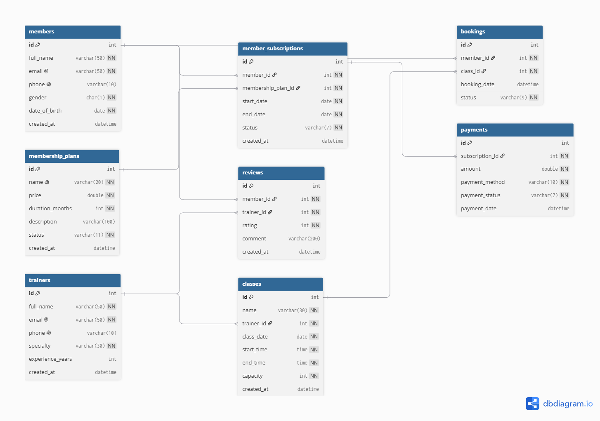

# Gym Management System

Gym Management System is a database designed to manage the main operations of a gym.

The system manages members, membership plans, subscriptions, trainers, classes, bookings, reviews, and payments.

## Business Idea

The main goal of the system is to organize the gym's daily operations and keep the data connected.

A member can subscribe to an available membership plan, and the subscription starts as pending until the payment is completed. Members can also book gym classes and review trainers.

The system also helps the gym track active and expired subscriptions, available plans, class capacity, payments, and trainer information.

## Tables

- **Members:** Stores gym members and their personal information.
- **Membership Plans:** Stores the available gym plans, prices, and duration.
- **Member Subscriptions:** Connects members with their selected plans and tracks the subscription status.
- **Trainers:** Stores trainer information, specialty, and experience.
- **Classes:** Manages gym classes, schedules, trainers, and capacity.
- **Bookings:** Tracks members' class bookings and cancellations.
- **Reviews:** Allows members to rate and review trainers.
- **Payments:** Tracks subscription payments and whether the payment was successful or failed.

## Database Schema

## Files

- `LAB 9 Gym Management.pdf` - Contains the SQL code including DDL, DML, DQL, and business queries.
- `gymManagementDiagram.png` - Database schema diagram.
